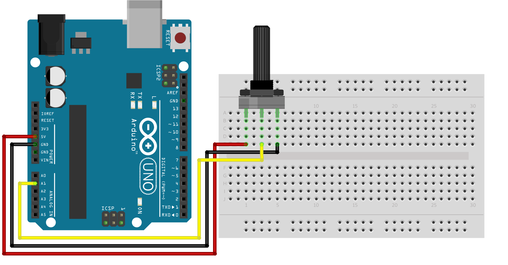
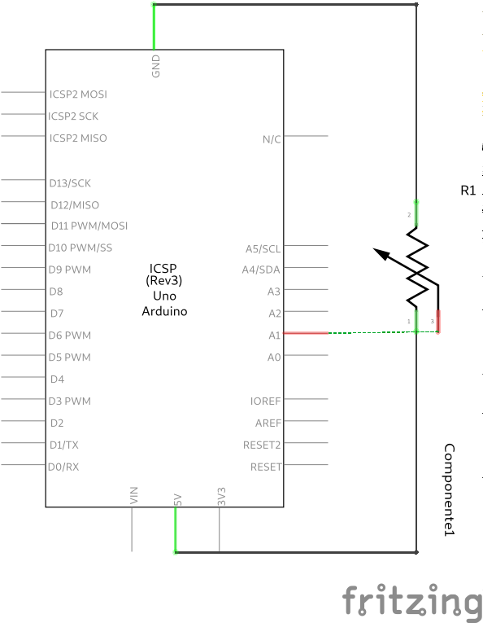
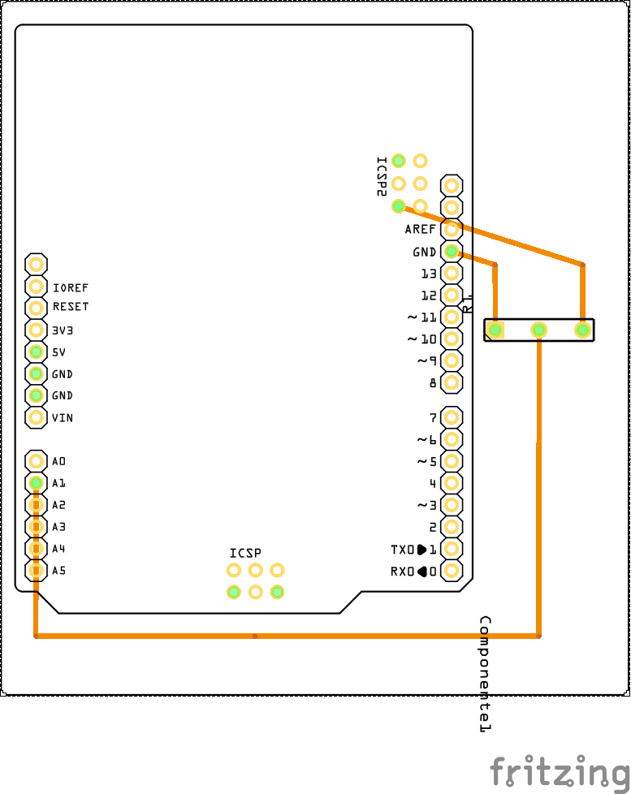

## Arduino Practica 10

Practica que hace lectura análogica de un potenciométro.

### Materiales

* Arduino
* Equipo de cómputo
* Cable USB
* x1 potenciometro de 10k

Conectar de acuerdo al diagrama:

O de acuerdo al esquemático:

También de referencia el PCB:

