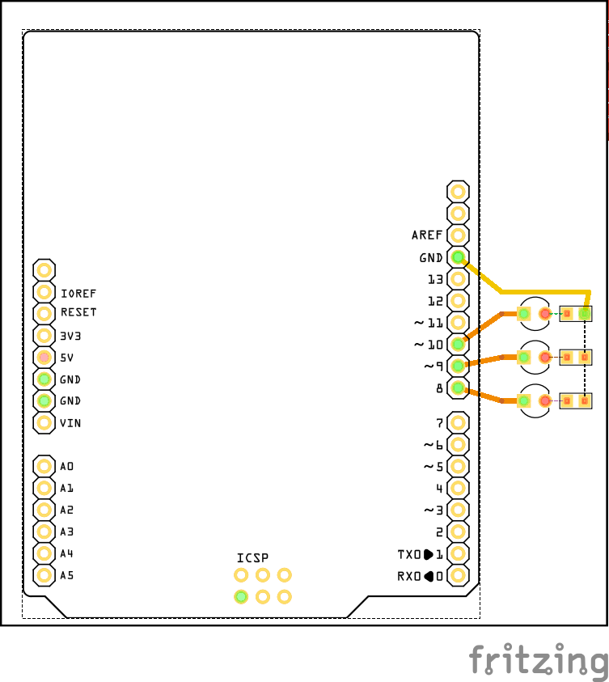

## Arduino Practica 9

Practica que simula un semáforo programado en Arduino.

### Materiales

* Arduino
* Equipo de cómputo
* Cable USB
* Diodo LED Rojo
* Diodo LED Amarillo
* Diodo LED Verde
* x3 Resistencia de 220 Oms o 330 Oms

Conectar de acuerdo al diagrama:

O de acuerdo al esquemático:

También de referencia el PCB:

