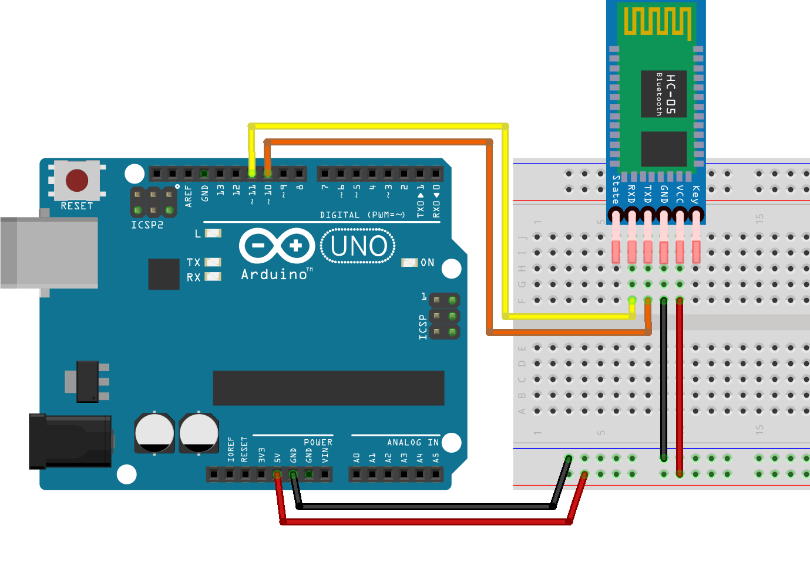

# Guía de Configuración: Arduino + Bluetooth HC-06 (4 pines)
Esta guía resume los pasos para solucionar errores de conexión y configurar módulos Bluetooth que no poseen botón físico (comúnmente modelos HC-06).

1. Conexión de Hardware
Para configurar el módulo, asegúrate de que el LED esté parpadeando rápido (modo desconectado).

Nota sobre el pin RXD del BT: Aunque funciona a 5V, lo ideal para larga duración es usar un divisor de tensión para bajar la señal del Arduino a 3.3V.



2. Código de Configuración (Sketch)
Copia y sube este código a tu Arduino. Está diseñado para actuar como puente entre el Monitor Serial y el Bluetooth.

3. Configuración del Monitor Serial
Para que el comando AT sea reconocido, la ventana del Monitor Serial debe estar así:

Velocidad: 9600 baudios.

```bash
Ajuste de línea: - Prueba primero con "Sin ajuste de línea" (No line ending).
```

Si no responde, cambia a `"Ambos NL & CR" (Both NL & CR).`

4. Comandos AT para el HC-06
Los comandos deben escribirse siempre en MAYÚSCULAS.

| Comando AT | Descripción | Ejemplo de Respuesta |
|------------|-------------|---------------------|
| AT | Prueba de conexión | OK |
| AT+NAME<nombre> | Cambiar nombre del módulo | OKsetname |
| AT+BAUD<velocidad> | Cambiar velocidad (4=9600, 5=19200, 6=38400, 7=57600, 8=115200) | OK<baudrate> |
| AT+PIN<codigo> | Cambiar código PIN (4 dígitos) | OKsetpin |
| AT+PSWD<codigo> | Cambiar contraseña (4 dígitos) | OKsetpin |
| AT+VERSION | Ver versión del firmware | OKlinvorV1.8 |
| AT+ROLE=0 | Modo esclavo (por defecto) | OK+ROLE=0 |
| AT+ROLE=1 | Modo maestro | OK+ROLE=1 |
| AT+DEFAULT | Restablecer valores de fábrica | OK |

Ejemplos prácticos:

- Cambiar nombre: `AT+NAME MiRobot` → OKsetname
- Cambiar PIN: `AT+PIN1234` → OKsetpin  
- Cambiar velocidad a 38400: `AT+BAUD6` → OK38400
- Ver versión: `AT+VERSION` → OKlinvorV1.8
- Restablecer: `AT+DEFAULT` → OK

**Nota**: Muchos modelos HC-06 no permiten "consultar" el nombre, solo "cambiarlo". Si AT+NAME no devuelve nada, simplemente usa AT+NAMENUEVONOMBRE para asignarle uno.

5. Solución de Problemas Comunes
El comando AT no responde:
- LED Fijo: El módulo está conectado a un celular. Desconéctalo para que parpadee y acepte comandos.
- Cables Invertidos: Prueba intercambiando los cables en los pines 10 y 11.
- Velocidad Incorrecta: Si el módulo fue usado antes, quizás su velocidad no sea 9600. Prueba cambiando miBT.begin(9600) a 38400 o 57600.
- Alimentación Insuficiente: Si lo conectaste al pin 3.3V del Arduino, cámbialo a 5V.
- Aparecen símbolos raros (basura):
La velocidad (baudrate) en el código no coincide con la del módulo. 
- Prueba las diferentes velocidades estándar (9600, 19200, 38400, 57600, 115200).
- Guía generada para configuración de módulos Bluetooth esclavos.